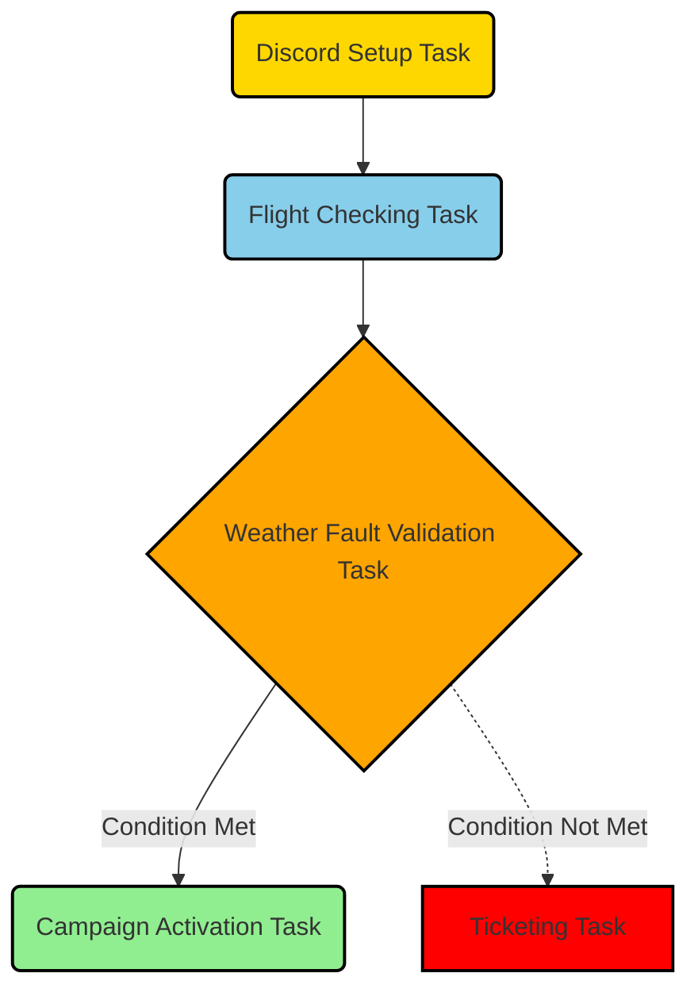

Task 1: Setting up the Job on Discord using the ENV File Form
-------------------------------------------------------------

In this task, you will setup the environment in Discord using the HTML form. The form will allow you to input values for the environment variables in the `.env` file.

Task 2: Flight Checking
-----------------------

This task involves setting up the system to check flight statuses based on the configured interval in the `.env` file. The system will monitor the flights for the airlines and airports configured in the `.env` file and notify you about flight status.

Task 3: Weather Fault Validation
--------------------------------

This task involves validating the weather conditions. The system will check the weather for the airports configured in the `.env` file and determine if the conditions match the non-fault weather conditions specified in the `.env` file. If there is a match, it will notify you.

Task 4: Ticketing or Campaign Activation
----------------------------------------

This is the final task. Depending on the results of the flight checking and weather fault validation tasks, this task will either create a ticket in Zammad or activate a campaign in List Monk. The details for Zammad and List Monk are configured in the `.env` file.

Each task depends on the configuration in the `.env` file and can be updated by updating the environment variables. All tasks will make use of the same `.env` file provided. Be sure to replace `YOUR_ZAMMAD_URL`, `YOUR_ZAMMAD_TOKEN`, `YOUR_LIST_MONK_URL`, `YOUR_LIST_MONK_TOKEN`, and `YOUR_DISCORD_BOT_TOKEN` with your actual values.

* * *

Code Explained
-------------------------------------------------------------

1.  Importing Required Modules: The script begins by importing necessary modules from various libraries, including `os`, `requests`, `json`, `datetime`, `timedelta`, `dotenv`, `airflow`, and specific operators from the `airflow.providers.discord.operators` package.
    
2.  Loading Environment Variables: The `load_dotenv()` function is called to load environment variables from the `.env` file. This file contains configurations for various aspects of the flight checking system.
    
3.  Discord Webhook URL: The Discord webhook URL is retrieved from the environment variable `DISCORD_WEBHOOK_URL`.
    
4.  FlightChecker Class: A `FlightChecker` class is defined to handle flight checking operations. It has an initializer method (`__init__`) that loads environment variables related to flights, airports, airlines, intervals, thresholds, and weather conditions.
    
5.  FlightChecker Methods: The `FlightChecker` class defines several methods:
    
    *   `get_flight_info`: Sends a request to the flights API to retrieve flight information for a specific airport and airline.
    *   `check_flights`: Checks the flights for a given airport and airline, considering opening and closing hours. If a flight is delayed or canceled within specific criteria, it prints the status and calls the `notify_plugin` method.
    *   `notify_plugin`: Placeholder method for notifying a plugin about flight status. The implementation depends on specific requirements.
6.  Initializing the FlightChecker: An instance of the `FlightChecker` class is created named `flight_checker`.
    
7.  Defining Default Arguments for the DAG: A dictionary named `default_args` is defined to specify default arguments for the tasks in the DAG. These arguments include the start date, number of retries, and retry delay.
    
8.  Initializing the DAG: The `DAG` object is initialized with the name `'flight_checker'` and the provided `default_args`. Other parameters include the description, schedule interval, and catchup settings.
    
9.  Task 1: Discord Setup Task: A `PythonOperator` named `discord_setup_task` is created. It prints a message indicating that the job is being set up on Discord. This task is responsible for setting up the environment on Discord using an HTML form.
    
10.  Task 2: Flight Checking Task: A `PythonOperator` named `flight_checking_task` is created. It invokes the `check_flights` method of the `flight_checker` instance for each combination of airports and airlines configured. This task monitors flight statuses based on the configured interval and notifies about delays or cancellations.
    
11.  Task 3: Weather Fault Validation Task: A `PythonOperator` named `weather_fault_validation_task` is created. It simply prints a message indicating that weather faults are being checked. This task is a placeholder and needs to be replaced with the actual implementation for validating weather conditions.
    
12.  Task 4: Ticketing or Campaign Activation Task: A `PythonOperator` named `ticketing_or_campaign_activation_task` is created. It prints a message indicating that a campaign or ticketing is being activated. This task is a placeholder and needs to be replaced with the actual implementation for creating a ticket in Zammad or activating a campaign in List Monk.
    
13.  Defining Dependencies: Dependencies between the tasks are defined using the `>>` operator. The execution flow starts with the `discord_setup_task`, followed by `flight_checking_task`, `weather_fault_validation_task`, and finally `ticketing_or_campaign_activation_task`.
    
