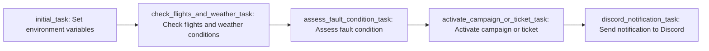

### 1\. Discord Integration and Environment Variable Updates

The flight checker application utilizes Discord for seamless communication between admin users and the automation system. Discord is used specifically for setting up environment variables by allowing admin users to modify parameters through HTML forms.

Admin users interact with the flight checker application in Discord chat, where they have access to user-friendly HTML forms. These forms enable them to update the necessary environment variables by submitting the desired values.

### 2\. Flight Checking and Delay Identification

The flight checker continuously monitors flight statuses for specified airports and airlines. The primary objective is to identify delayed flights in a timely manner to manage travel arrangements effectively and minimize disruptions.

When a flight delay is detected, the flight checker performs thorough validations to ensure the accuracy of the information. It cross-references data from the flight information API and conducts additional checks to confirm the delay.

### 3\. Fault Assessment and Risk Mitigation

Upon confirming a flight delay, the flight checker performs comprehensive fault assessments. These assessments aim to identify potential issues, evaluate associated risks, and determine appropriate courses of action.

The flight checker leverages various data sources, including weather APIs such as [WeatherAPI](https://www.weatherapi.com/docs/), to assess the impact of external factors on flight delays. By considering weather conditions, historical trends, and other relevant information, the system can make informed decisions regarding fault mitigation strategies.

### 4\. Ticket Creation or Campaign Activation

Following the fault assessment, the flight checker initiates the creation of tickets or the activation of campaigns. It utilizes APIs such as [ListMonk API](https://listmonk.app/docs/apis/campaigns/) and [Zammad API](https://docs.zammad.org/en/latest/api/ticket/index.html) to generate tickets for affected passengers or activate campaigns for communication purposes.

Creating tickets or activating campaigns allows the flight checker to proactively engage with passengers, providing them with relevant information, alternative options, or necessary assistance based on the specific situation.

### 5\. Weather Data Integration

To enhance the accuracy of flight delay assessments, the flight checker integrates real-time weather data from weather APIs such as [WeatherAPI](https://www.weatherapi.com/docs/). By retrieving weather information for relevant airport locations, the system considers weather conditions as a factor when evaluating flight delays.

Weather data, including parameters like temperature, wind speed, precipitation, and cloud cover, is taken into account alongside flight information to make more informed decisions and provide accurate notifications to stakeholders.

### 6\. Apache Airflow Orchestration

The flight checker application is orchestrated using Apache Airflow, a powerful workflow management platform. Airflow schedules and executes tasks within the flight checking workflow based on the defined DAG (Directed Acyclic Graph).

Tasks in the workflow include flight checking, fault assessment, ticket creation or campaign activation, weather data integration, and sending notifications. Airflow ensures the timely execution of these tasks according to the specified schedule and dependencies.

By utilizing Apache Airflow, the flight checker achieves robust task orchestration, enabling efficient and automated monitoring of flights, fault assessment, seamless coordination among different components, and reliable scheduling.

In conclusion, the flight checker application leverages Discord for environment variable updates, monitors flight delays, assesses faults and risks, creates tickets or activates campaigns, integrates weather data, and utilizes Apache Airflow for efficient task orchestration. The system integrates APIs such as [ListMonk API](https://listmonk.app/docs/apis/campaigns/), [Zammad API](https://docs.zammad.org/en/latest/api/ticket/index.html), [DiscordWebhookOperator](https://airflow.apache.org/docs/apache-airflow-providers-discord/stable/_api/airflow/providers/discord/operators/discord_webhook/index.html), and [WeatherAPI](https://www.weatherapi.com/docs/) to perform these functions effectively.

### Code Explained 

1.  The code begins by importing the required modules:
    
    *   `os`: Provides a way to interact with the operating system.
    *   `requests`: Enables making HTTP requests to retrieve flight information.
    *   `json`: Allows working with JSON data.
    *   `datetime` and `timedelta` from the `datetime` module: Facilitates working with dates and times.
    *   `load_dotenv` from the `dotenv` module: Loads environment variables from a `.env` file.
    *   `DAG` from the `airflow` module: Represents the Directed Acyclic Graph (DAG) that defines the workflow.
    *   `PythonOperator` from the `airflow.operators.python_operator` module: Executes Python callables as tasks in the DAG.
    *   `DiscordWebhookOperator` from the `airflow.providers.discord.operators.discord_webhook` module: Sends notifications to a Discord channel.
2.  The code loads environment variables from the `.env` file using `load_dotenv()`.
    
3.  It retrieves the Discord webhook URL from the environment variable `DISCORD_WEBHOOK_URL`.
    
4.  The code defines a class called `FlightChecker`, which encapsulates the functionality related to flight checking. It has the following attributes and methods:
    
    *   Attributes:
        *   `api_key`: Stores the API key for accessing flight information.
        *   `airports`: Stores a list of airports to check flights for.
        *   `airlines`: Stores a list of airlines to check flights for.
        *   `check_interval`: Specifies the interval (in minutes) at which flights should be checked.
        *   `delay_threshold`: Specifies the minimum delay threshold (in minutes) for considering a flight as delayed.
        *   `time_to_departure_threshold`: Specifies the minimum time threshold (in hours) before departure to consider a flight for delay checks.
        *   `cancelled_flight_time_window_start`: Specifies the start time (in minutes) within which a flight can be considered cancelled.
        *   `cancelled_flight_time_window_end`: Specifies the end time (in minutes) within which a flight can be considered cancelled.
        *   `api_host`: Stores the host URL for the flight information API.
        *   `api_endpoint`: Stores the endpoint for the flight information API.
        *   `api_url`: Stores the complete URL for accessing the flight information API.
        *   `env_weather`: Stores the weather environment variable (currently unused).
        *   `airport_hours`: Stores the opening and closing hours for each airport.
        *   `last_delay_print_time`: Stores the last delay print time for each airport.
    *   Methods:
        *   `get_flight_info(airport: str, airline: str)`: Sends a request to the flight information API and returns the flight information as JSON.
        *   `check_flights(airport: str, airline: str)`: Checks flight statuses for a specific airport and airline, prints delays and cancellations, and performs notifications and fault assessment.
5.  An instance of the `FlightChecker` class called `flight_checker` is created.
    
6.  The code defines default arguments for the tasks in the DAG. These arguments include the start date, number of retries, and retry delay.
    
7.  The DAG (Directed Acyclic Graph) is initialized with the name `'flight_checker'` and the provided default arguments. It also includes a description, a schedule interval of one minute, and `catchup` set to `False` (i.e., tasks won't be triggered for the missed schedule intervals).
    
8.  The code defines a callable function called `initial_task_callable()`. This function is responsible for listening to the admin and setting environment variables accordingly. However, the function itself is not implemented in the provided code.
    
9.  A `PythonOperator` called `initial_task` is defined, which executes the `initial_task_callable()` function as a task in the DAG.
    
10.  Another callable function called `check_flights_and_weather_conditions_callable()` is defined. This function iterates through the airports and airlines, calls the `check_flights()` method of the `flight_checker` instance, and retrieves weather data (currently commented out).
    
11.  A `PythonOperator` called `check_flights_and_weather_task` is defined, which executes the `check_flights_and_weather_conditions_callable()` function as a task in the DAG.
    
12.  Another callable function called `assess_fault_condition_callable()` is defined. This function iterates through the airports and airlines, calls the `check_flights()` method of the `flight_checker` instance, retrieves weather data (currently commented out), and assesses fault conditions (currently commented out).
    
13.  A `PythonOperator` called `assess_fault_condition_task` is defined, which executes the `assess_fault_condition_callable()` function as a task in the DAG.
    
14.  A callable function called `activate_campaign_or_ticket_callable()` is defined. The actual code for this function is not provided in the given code snippet.
    
15.  A `PythonOperator` called `activate_campaign_or_ticket_task` is defined, which executes the `activate_campaign_or_ticket_callable()` function as a task in the DAG.
    
16.  A `DiscordWebhookOperator` called `discord_notification_task` is defined. It sends a notification to a Discord channel using the webhook URL provided.
    
17.  The dependencies between the tasks in the DAG are defined using the `>>` operator, which represents the order of execution.
    
18.  Finally, the complete DAG is ready and can be scheduled and executed by an Apache Airflow scheduler. The DAG consists of tasks for initializing environment variables, checking flights and weather conditions, assessing fault conditions, activating campaigns or creating tickets, and sending a Discord notification when all tasks are completed successfully.
    
